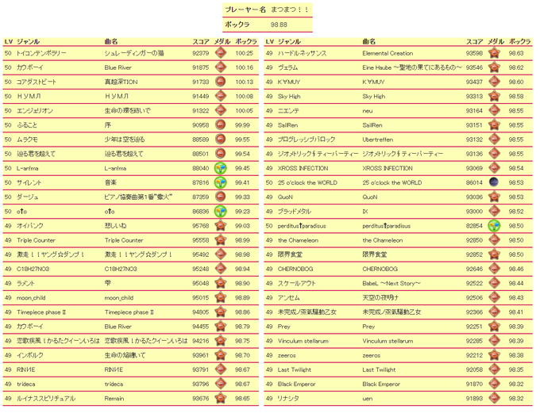
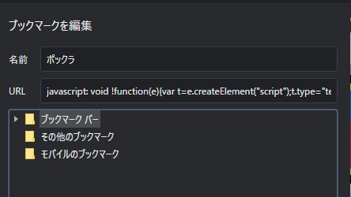

# popn-class

ポックラ一覧を出すスクリプト


# 使い方

1. 次のスクリプトをブックマークに追加する

```
javascript: void !function(e){var t=e.createElement("script");t.type="text/javascript",t.src="///cdn.jsdelivr.net/gh/ssdh233/popn-class/dist/bundle.js",e.head.appendChild(t)}(document);
```



2. [ポップンのサイト](https://p.eagate.573.jp/game/popn/peace/p/playdata/index.html)にログインして、先のブックマークをクリックする。

# Contribute

## Build

```
yarn build // or yarn build:watch
```

## Test

ユニットテストを作ってくださる方大歓迎です><

今はないので手動でテストしてください。

## Creating a PR

github 上のファイルをホストするCDN[jsdelivr](https://cdn.jsdelivr.net/)を使って配布していますので、`dist/bundle.js`も一緒にコミットしてください。
